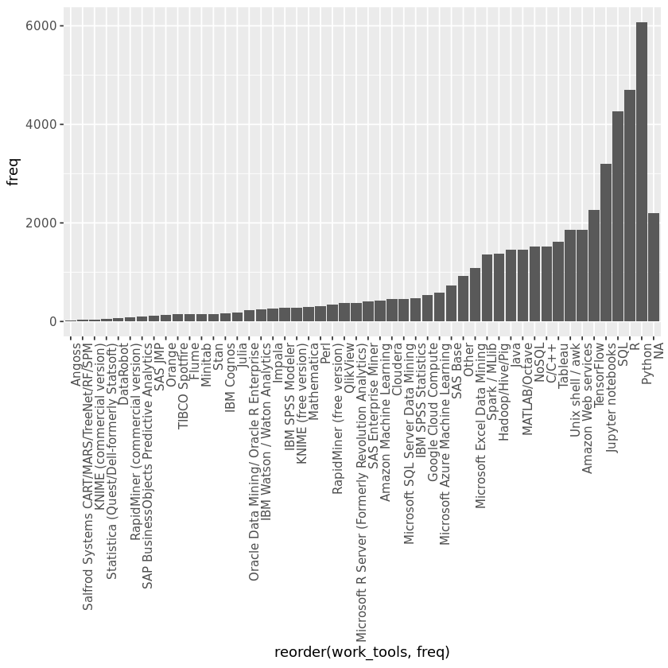
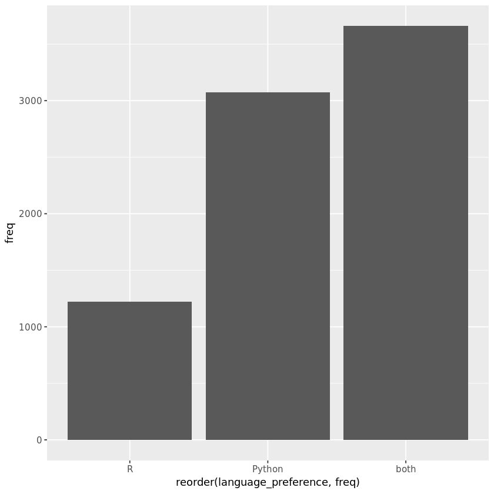
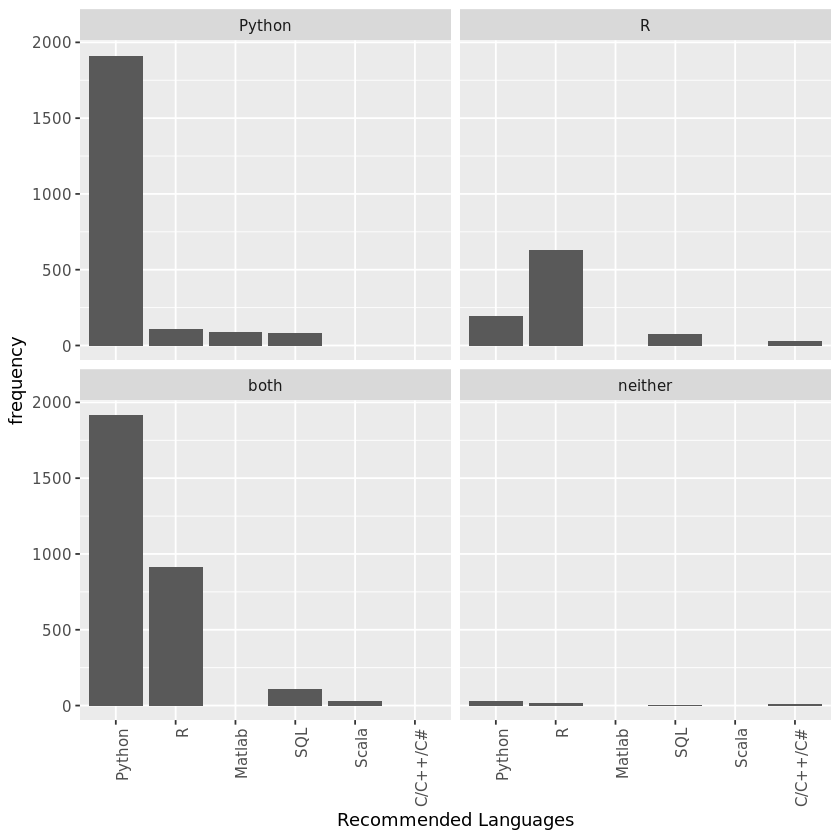

---
output:
  word_document: default
  html_document: default
---

## 1. Welcome to the world of data science
<p>Throughout the world of data science, there are many languages and tools that can be used to complete a given task. While you are often able to use whichever tool you prefer, it is often important for analysts to work with similar platforms so that they can share their code with one another. Learning what professionals in the data science industry use while at work can help you gain a better understanding of things that you may be asked to do in the future. </p>
<p>In this project, we are going to find out what tools and languages professionals use in their day-to-day work. Our data comes from the <a href="https://www.kaggle.com/kaggle/kaggle-survey-2017?utm_medium=partner&utm_source=datacamp.com&utm_campaign=ml+survey+case+study">Kaggle Data Science Survey</a> which includes responses from over 10,000 people that write code to analyze data in their daily work. </p>


```R
# Load necessary packages
library(tidyverse)

# Load the data
responses <- read_csv("datasets/kagglesurvey.csv")

# Print the first 10 rows
head(responses)
str(responses)
```

    Parsed with column specification:
    cols(
      Respondent = col_integer(),
      WorkToolsSelect = col_character(),
      LanguageRecommendationSelect = col_character(),
      EmployerIndustry = col_character(),
      WorkAlgorithmsSelect = col_character()
    )


<table>
<thead><tr><th scope=col>Respondent</th><th scope=col>WorkToolsSelect</th><th scope=col>LanguageRecommendationSelect</th><th scope=col>EmployerIndustry</th><th scope=col>WorkAlgorithmsSelect</th></tr></thead>
<tbody>
	<tr><td>1                                                                                                                                                                                                                  </td><td>Amazon Web services,Oracle Data Mining/ Oracle R Enterprise,Perl                                                                                                                                                   </td><td>F#                                                                                                                                                                                                                 </td><td>Internet-based                                                                                                                                                                                                     </td><td>Neural Networks,Random Forests,RNNs                                                                                                                                                                                </td></tr>
	<tr><td>2                                                                                                                                                                                                                  </td><td>Amazon Machine Learning,Amazon Web services,Cloudera,Hadoop/Hive/Pig,Impala,Java,Mathematica,MATLAB/Octave,Microsoft Excel Data Mining,Microsoft SQL Server Data Mining,NoSQL,Python,R,SAS Base,SAS JMP,SQL,Tableau</td><td>Python                                                                                                                                                                                                             </td><td>Mix of fields                                                                                                                                                                                                      </td><td>Bayesian Techniques,Decision Trees,Random Forests,Regression/Logistic Regression                                                                                                                                   </td></tr>
	<tr><td>3                                                                                                                                                                                                                  </td><td>C/C++,Jupyter notebooks,MATLAB/Octave,Python,R,TensorFlow                                                                                                                                                          </td><td>Python                                                                                                                                                                                                             </td><td>Technology                                                                                                                                                                                                         </td><td>Bayesian Techniques,CNNs,Ensemble Methods,Neural Networks,Regression/Logistic Regression,SVMs                                                                                                                      </td></tr>
	<tr><td>4                                                                                                                                                                                                                  </td><td>Jupyter notebooks,Python,SQL,TensorFlow                                                                                                                                                                            </td><td>Python                                                                                                                                                                                                             </td><td>Academic                                                                                                                                                                                                           </td><td>Bayesian Techniques,CNNs,Decision Trees,Gradient Boosted Machines,Neural Networks,Random Forests,Regression/Logistic Regression                                                                                    </td></tr>
	<tr><td>5                                                                                                                                                                                                                  </td><td>C/C++,Cloudera,Hadoop/Hive/Pig,Java,NoSQL,R,Unix shell / awk                                                                                                                                                       </td><td>R                                                                                                                                                                                                                  </td><td>Government                                                                                                                                                                                                         </td><td>NA                                                                                                                                                                                                                 </td></tr>
	<tr><td>6                                                                                                                                                                                                                  </td><td>SQL                                                                                                                                                                                                                </td><td>Python                                                                                                                                                                                                             </td><td>Non-profit                                                                                                                                                                                                         </td><td>NA                                                                                                                                                                                                                 </td></tr>
</tbody>
</table>


    Classes 'tbl_df', 'tbl' and 'data.frame':	10153 obs. of  5 variables:
     $ Respondent                  : int  1 2 3 4 5 6 7 8 9 10 ...
     $ WorkToolsSelect             : chr  "Amazon Web services,Oracle Data Mining/ Oracle R Enterprise,Perl" "Amazon Machine Learning,Amazon Web services,Cloudera,Hadoop/Hive/Pig,Impala,Java,Mathematica,MATLAB/Octave,Micr"| __truncated__ "C/C++,Jupyter notebooks,MATLAB/Octave,Python,R,TensorFlow" "Jupyter notebooks,Python,SQL,TensorFlow" ...
     $ LanguageRecommendationSelect: chr  "F#" "Python" "Python" "Python" ...
     $ EmployerIndustry            : chr  "Internet-based" "Mix of fields" "Technology" "Academic" ...
     $ WorkAlgorithmsSelect        : chr  "Neural Networks,Random Forests,RNNs" "Bayesian Techniques,Decision Trees,Random Forests,Regression/Logistic Regression" "Bayesian Techniques,CNNs,Ensemble Methods,Neural Networks,Regression/Logistic Regression,SVMs" "Bayesian Techniques,CNNs,Decision Trees,Gradient Boosted Machines,Neural Networks,Random Forests,Regression/Log"| __truncated__ ...
     - attr(*, "spec")=List of 2
      ..$ cols   :List of 5
      .. ..$ Respondent                  : list()
      .. .. ..- attr(*, "class")= chr  "collector_integer" "collector"
      .. ..$ WorkToolsSelect             : list()
      .. .. ..- attr(*, "class")= chr  "collector_character" "collector"
      .. ..$ LanguageRecommendationSelect: list()
      .. .. ..- attr(*, "class")= chr  "collector_character" "collector"
      .. ..$ EmployerIndustry            : list()
      .. .. ..- attr(*, "class")= chr  "collector_character" "collector"
      .. ..$ WorkAlgorithmsSelect        : list()
      .. .. ..- attr(*, "class")= chr  "collector_character" "collector"
      ..$ default: list()
      .. ..- attr(*, "class")= chr  "collector_guess" "collector"
      ..- attr(*, "class")= chr "col_spec"


```R
library("testthat")
library('IRkernel.testthat')

run_tests({
    test_that("Read in data correctly.", {
        expect_is(responses, "tbl_df", 
            info = 'You should use read_csv (with an underscore) to read "datasets/kagglesurvey.csv" into responses')
    })
    
    test_that("Read in data correctly.", {
        responses_test <- read_csv('datasets/kagglesurvey.csv')
        expect_equivalent(responses, responses_test, 
            info = 'responses should contain the data in "datasets/kagglesurvey.csv"')
    })
    
})
```


    <ProjectReporter>
      Inherits from: <ListReporter>
      Public:
        .context: NULL
        .end_context: function (context) 
        .start_context: function (context) 
        add_result: function (context, test, result) 
        all_tests: environment
        cat_line: function (...) 
        cat_tight: function (...) 
        clone: function (deep = FALSE) 
        current_expectations: environment
        current_file: some name
        current_start_time: 5.736 0.091 365.9 0.005 0
        dump_test: function (test) 
        end_context: function (context) 
        end_reporter: function () 
        end_test: function (context, test) 
        get_results: function () 
        initialize: function (...) 
        is_full: function () 
        out: 3
        results: environment
        rule: function (...) 
        start_context: function (context) 
        start_file: function (name) 
        start_reporter: function () 
        start_test: function (context, test) 


## 2. Using multiple tools
<p>Now that we've loaded in the survey results, we want to focus on the tools and languages that the survey respondents use at work.</p>


```R
# Print the first respondent's tools and languages
head(responses$WorkToolsSelect)

# Create a new data frame called tools
tools <- responses 
#tools

# Add a new column, and unnest the new column
tools <- tools  %>% 
    mutate(work_tools = strsplit(as.character(WorkToolsSelect), ","))  %>% 
    # .... YOUR CODE FOR TASK 2 ....
    unnest(work_tools)

# View the first 6 rows of tools
head(tools)
```


<ol class=list-inline>
	<li>'Amazon Web services,Oracle Data Mining/ Oracle R Enterprise,Perl'</li>
	<li>'Amazon Machine Learning,Amazon Web services,Cloudera,Hadoop/Hive/Pig,Impala,Java,Mathematica,MATLAB/Octave,Microsoft Excel Data Mining,Microsoft SQL Server Data Mining,NoSQL,Python,R,SAS Base,SAS JMP,SQL,Tableau'</li>
	<li>'C/C++,Jupyter notebooks,MATLAB/Octave,Python,R,TensorFlow'</li>
	<li>'Jupyter notebooks,Python,SQL,TensorFlow'</li>
	<li>'C/C++,Cloudera,Hadoop/Hive/Pig,Java,NoSQL,R,Unix shell / awk'</li>
	<li>'SQL'</li>
</ol>


<table>
<thead><tr><th scope=col>Respondent</th><th scope=col>WorkToolsSelect</th><th scope=col>LanguageRecommendationSelect</th><th scope=col>EmployerIndustry</th><th scope=col>WorkAlgorithmsSelect</th><th scope=col>work_tools</th></tr></thead>
<tbody>
	<tr><td>1                                                                                                                                                                                                                  </td><td>Amazon Web services,Oracle Data Mining/ Oracle R Enterprise,Perl                                                                                                                                                   </td><td>F#                                                                                                                                                                                                                 </td><td>Internet-based                                                                                                                                                                                                     </td><td>Neural Networks,Random Forests,RNNs                                                                                                                                                                                </td><td>Amazon Web services                                                                                                                                                                                                </td></tr>
	<tr><td>1                                                                                                                                                                                                                  </td><td>Amazon Web services,Oracle Data Mining/ Oracle R Enterprise,Perl                                                                                                                                                   </td><td>F#                                                                                                                                                                                                                 </td><td>Internet-based                                                                                                                                                                                                     </td><td>Neural Networks,Random Forests,RNNs                                                                                                                                                                                </td><td>Oracle Data Mining/ Oracle R Enterprise                                                                                                                                                                            </td></tr>
	<tr><td>1                                                                                                                                                                                                                  </td><td>Amazon Web services,Oracle Data Mining/ Oracle R Enterprise,Perl                                                                                                                                                   </td><td>F#                                                                                                                                                                                                                 </td><td>Internet-based                                                                                                                                                                                                     </td><td>Neural Networks,Random Forests,RNNs                                                                                                                                                                                </td><td>Perl                                                                                                                                                                                                               </td></tr>
	<tr><td>2                                                                                                                                                                                                                  </td><td>Amazon Machine Learning,Amazon Web services,Cloudera,Hadoop/Hive/Pig,Impala,Java,Mathematica,MATLAB/Octave,Microsoft Excel Data Mining,Microsoft SQL Server Data Mining,NoSQL,Python,R,SAS Base,SAS JMP,SQL,Tableau</td><td>Python                                                                                                                                                                                                             </td><td>Mix of fields                                                                                                                                                                                                      </td><td>Bayesian Techniques,Decision Trees,Random Forests,Regression/Logistic Regression                                                                                                                                   </td><td>Amazon Machine Learning                                                                                                                                                                                            </td></tr>
	<tr><td>2                                                                                                                                                                                                                  </td><td>Amazon Machine Learning,Amazon Web services,Cloudera,Hadoop/Hive/Pig,Impala,Java,Mathematica,MATLAB/Octave,Microsoft Excel Data Mining,Microsoft SQL Server Data Mining,NoSQL,Python,R,SAS Base,SAS JMP,SQL,Tableau</td><td>Python                                                                                                                                                                                                             </td><td>Mix of fields                                                                                                                                                                                                      </td><td>Bayesian Techniques,Decision Trees,Random Forests,Regression/Logistic Regression                                                                                                                                   </td><td>Amazon Web services                                                                                                                                                                                                </td></tr>
	<tr><td>2                                                                                                                                                                                                                  </td><td>Amazon Machine Learning,Amazon Web services,Cloudera,Hadoop/Hive/Pig,Impala,Java,Mathematica,MATLAB/Octave,Microsoft Excel Data Mining,Microsoft SQL Server Data Mining,NoSQL,Python,R,SAS Base,SAS JMP,SQL,Tableau</td><td>Python                                                                                                                                                                                                             </td><td>Mix of fields                                                                                                                                                                                                      </td><td>Bayesian Techniques,Decision Trees,Random Forests,Regression/Logistic Regression                                                                                                                                   </td><td>Cloudera                                                                                                                                                                                                           </td></tr>
</tbody>
</table>


```R
run_tests({
    test_that("Tools and Languages were Split and Unnested", {
        expect_true(nrow(tools) == 47409, 
            info = 'Make sure that you split the tools at the commas and unnested them')
    })
    
    test_that("Tools and Languages were Unnested", {
        expect_is(tools$work_tools, "character", 
            info = 'The work_tools column should be of class "character". Make sure that you unnested the results of strsplit()')
    })
    
})
```


    <ProjectReporter>
      Inherits from: <ListReporter>
      Public:
        .context: NULL
        .end_context: function (context) 
        .start_context: function (context) 
        add_result: function (context, test, result) 
        all_tests: environment
        cat_line: function (...) 
        cat_tight: function (...) 
        clone: function (deep = FALSE) 
        current_expectations: environment
        current_file: some name
        current_start_time: 5.867 0.095 366.034 0.005 0
        dump_test: function (test) 
        end_context: function (context) 
        end_reporter: function () 
        end_test: function (context, test) 
        get_results: function () 
        initialize: function (...) 
        is_full: function () 
        out: 3
        results: environment
        rule: function (...) 
        start_context: function (context) 
        start_file: function (name) 
        start_reporter: function () 
        start_test: function (context, test) 


## 3. Counting users of each tool
<p>Now that we've split apart all of the tools used by each respondent, we can figure out which tools are the most popular.</p>


```R
# Create a new data frame
tool_count <- tools

# Group the data by work_tools, summarise the counts, and arrange in descending order
tool_count <- tools  %>% 
    group_by(work_tools)  %>% 
    #.... YOUR CODE FOR TASK 3 .... 
    summarise(freq = n()) %>%
    arrange(desc(freq))
    
# Print the first 6 results
#.... YOUR CODE FOR TASK 3 ....
head(tool_count)
str(tool_count)
```


<table>
<thead><tr><th scope=col>work_tools</th><th scope=col>freq</th></tr></thead>
<tbody>
	<tr><td>Python           </td><td>6073             </td></tr>
	<tr><td>R                </td><td>4708             </td></tr>
	<tr><td>SQL              </td><td>4261             </td></tr>
	<tr><td>Jupyter notebooks</td><td>3206             </td></tr>
	<tr><td>TensorFlow       </td><td>2256             </td></tr>
	<tr><td>NA               </td><td>2198             </td></tr>
</tbody>
</table>


    Classes 'tbl_df', 'tbl' and 'data.frame':	50 obs. of  2 variables:
     $ work_tools: chr  "Python" "R" "SQL" "Jupyter notebooks" ...
     $ freq      : int  6073 4708 4261 3206 2256 2198 1868 1854 1619 1528 ...


```R
run_tests({
    test_that("Tools were Grouped and Summarised", {
        expect_true(nrow(tool_count) == 50, 
            info = 'Make sure that you grouped by tools and then summarised')
    })
    
    test_that("Values were sorted correctly", {
        expect_true(tool_count[1, 2] == 6073, 
            info = 'Do not forget to sort your tool counts from largest to smallest')
    })
    
})
```


    <ProjectReporter>
      Inherits from: <ListReporter>
      Public:
        .context: NULL
        .end_context: function (context) 
        .start_context: function (context) 
        add_result: function (context, test, result) 
        all_tests: environment
        cat_line: function (...) 
        cat_tight: function (...) 
        clone: function (deep = FALSE) 
        current_expectations: environment
        current_file: some name
        current_start_time: 5.912 0.095 366.079 0.005 0
        dump_test: function (test) 
        end_context: function (context) 
        end_reporter: function () 
        end_test: function (context, test) 
        get_results: function () 
        initialize: function (...) 
        is_full: function () 
        out: 3
        results: environment
        rule: function (...) 
        start_context: function (context) 
        start_file: function (name) 
        start_reporter: function () 
        start_test: function (context, test) 


## 4. Plotting the most popular tools
<p>Let's see how your favorite tools stack up against the rest.</p>


```R
# Create a bar chart of the work_tools column, most counts on the far right
ggplot(tool_count, aes(reorder(work_tools, freq), freq)) + 
    geom_bar(stat="identity") +
    theme(axis.text.x = element_text(angle = 90, hjust = 1))
```





```R
run_tests({
   test_that("Plot is a bar chart",{
      p <- last_plot()
      q <- p$layers[[1]]
      expect_is(q$geom, "GeomBar", 
                info = "You should plot a bar chart with ggplot")
    })
})
```


    <ProjectReporter>
      Inherits from: <ListReporter>
      Public:
        .context: NULL
        .end_context: function (context) 
        .start_context: function (context) 
        add_result: function (context, test, result) 
        all_tests: environment
        cat_line: function (...) 
        cat_tight: function (...) 
        clone: function (deep = FALSE) 
        current_expectations: environment
        current_file: some name
        current_start_time: 6.164 0.099 366.334 0.005 0
        dump_test: function (test) 
        end_context: function (context) 
        end_reporter: function () 
        end_test: function (context, test) 
        get_results: function () 
        initialize: function (...) 
        is_full: function () 
        out: 3
        results: environment
        rule: function (...) 
        start_context: function (context) 
        start_file: function (name) 
        start_reporter: function () 
        start_test: function (context, test) 


## 5. The R vs Python debate
<p>Within the field of data science, there is a lot of debate among professionals about whether R or Python should reign supreme. You can see from our last figure that R and Python are the two most commonly used languages, but it's possible that many respondents use both R and Python. Let's take a look at how many people use R, Python, and both tools.</p>


```R
# Create a new data frame called debate_tools
debate_tools <- responses

# Creat a new column called language preference
debate_tools <- debate_tools  %>% 
   mutate(language_preference = case_when(
        grepl("R", WorkToolsSelect) & !grepl("Python", WorkToolsSelect) ~ "R",
        !grepl("R", WorkToolsSelect) & grepl("+", WorkToolsSelect) ~ "Python",
        grepl("R", WorkToolsSelect) & grepl("Python", WorkToolsSelect) ~ "both",
        !grepl("R", WorkToolsSelect) & !grepl("Python", WorkToolsSelect) ~ "neither"
   ))

# Print the first 6 rows
head(debate_tools)
```


<table>
<thead><tr><th scope=col>Respondent</th><th scope=col>WorkToolsSelect</th><th scope=col>LanguageRecommendationSelect</th><th scope=col>EmployerIndustry</th><th scope=col>WorkAlgorithmsSelect</th><th scope=col>language_preference</th></tr></thead>
<tbody>
	<tr><td>1                                                                                                                                                                                                                  </td><td>Amazon Web services,Oracle Data Mining/ Oracle R Enterprise,Perl                                                                                                                                                   </td><td>F#                                                                                                                                                                                                                 </td><td>Internet-based                                                                                                                                                                                                     </td><td>Neural Networks,Random Forests,RNNs                                                                                                                                                                                </td><td>R                                                                                                                                                                                                                  </td></tr>
	<tr><td>2                                                                                                                                                                                                                  </td><td>Amazon Machine Learning,Amazon Web services,Cloudera,Hadoop/Hive/Pig,Impala,Java,Mathematica,MATLAB/Octave,Microsoft Excel Data Mining,Microsoft SQL Server Data Mining,NoSQL,Python,R,SAS Base,SAS JMP,SQL,Tableau</td><td>Python                                                                                                                                                                                                             </td><td>Mix of fields                                                                                                                                                                                                      </td><td>Bayesian Techniques,Decision Trees,Random Forests,Regression/Logistic Regression                                                                                                                                   </td><td>both                                                                                                                                                                                                               </td></tr>
	<tr><td>3                                                                                                                                                                                                                  </td><td>C/C++,Jupyter notebooks,MATLAB/Octave,Python,R,TensorFlow                                                                                                                                                          </td><td>Python                                                                                                                                                                                                             </td><td>Technology                                                                                                                                                                                                         </td><td>Bayesian Techniques,CNNs,Ensemble Methods,Neural Networks,Regression/Logistic Regression,SVMs                                                                                                                      </td><td>both                                                                                                                                                                                                               </td></tr>
	<tr><td>4                                                                                                                                                                                                                  </td><td>Jupyter notebooks,Python,SQL,TensorFlow                                                                                                                                                                            </td><td>Python                                                                                                                                                                                                             </td><td>Academic                                                                                                                                                                                                           </td><td>Bayesian Techniques,CNNs,Decision Trees,Gradient Boosted Machines,Neural Networks,Random Forests,Regression/Logistic Regression                                                                                    </td><td>Python                                                                                                                                                                                                             </td></tr>
	<tr><td>5                                                                                                                                                                                                                  </td><td>C/C++,Cloudera,Hadoop/Hive/Pig,Java,NoSQL,R,Unix shell / awk                                                                                                                                                       </td><td>R                                                                                                                                                                                                                  </td><td>Government                                                                                                                                                                                                         </td><td>NA                                                                                                                                                                                                                 </td><td>R                                                                                                                                                                                                                  </td></tr>
	<tr><td>6                                                                                                                                                                                                                  </td><td>SQL                                                                                                                                                                                                                </td><td>Python                                                                                                                                                                                                             </td><td>Non-profit                                                                                                                                                                                                         </td><td>NA                                                                                                                                                                                                                 </td><td>Python                                                                                                                                                                                                             </td></tr>
</tbody>
</table>


```R
run_tests({
    test_that("New column was created", {
        expect_is(debate_tools$language_preference, "character", 
            info = 'The language_preference column should be of class "character". Make sure that you filled this new column correctly')
    })
    
})
```


    <ProjectReporter>
      Inherits from: <ListReporter>
      Public:
        .context: NULL
        .end_context: function (context) 
        .start_context: function (context) 
        add_result: function (context, test, result) 
        all_tests: environment
        cat_line: function (...) 
        cat_tight: function (...) 
        clone: function (deep = FALSE) 
        current_expectations: environment
        current_file: some name
        current_start_time: 6.217 0.103 366.39 0.005 0
        dump_test: function (test) 
        end_context: function (context) 
        end_reporter: function () 
        end_test: function (context, test) 
        get_results: function () 
        initialize: function (...) 
        is_full: function () 
        out: 3
        results: environment
        rule: function (...) 
        start_context: function (context) 
        start_file: function (name) 
        start_reporter: function () 
        start_test: function (context, test) 


## 6. Plotting R vs Python users
<p>Now we just need to take a closer look at how many respondents use R, Python, and both!</p>


```R
# Create a new data frame
debate_plot <- debate_tools

# Group by language preference, calculate number of responses, and remove "neither"
debate_plot <- debate_plot  %>% 
   group_by(language_preference)  %>% 
   summarise(freq = n())  %>% 
   filter(language_preference != "neither")

head(debate_plot)

# Create a bar chart
ggplot(debate_plot, aes(x = reorder(language_preference, freq), freq)) +
geom_bar(stat = "identity")
```


<table>
<thead><tr><th scope=col>language_preference</th><th scope=col>freq</th></tr></thead>
<tbody>
	<tr><td>Python</td><td>3075  </td></tr>
	<tr><td>R     </td><td>1220  </td></tr>
	<tr><td>both  </td><td>3660  </td></tr>
</tbody>
</table>





```R
run_tests({
   test_that("Plot is a bar chart",{
      p <- last_plot()
      q <- p$layers[[1]]
      expect_is(q$geom, "GeomBar",
               info = "You should plot a bar chart with ggplot")
    })
})
```


    <ProjectReporter>
      Inherits from: <ListReporter>
      Public:
        .context: NULL
        .end_context: function (context) 
        .start_context: function (context) 
        add_result: function (context, test, result) 
        all_tests: environment
        cat_line: function (...) 
        cat_tight: function (...) 
        clone: function (deep = FALSE) 
        current_expectations: environment
        current_file: some name
        current_start_time: 6.431 0.107 366.607 0.005 0
        dump_test: function (test) 
        end_context: function (context) 
        end_reporter: function () 
        end_test: function (context, test) 
        get_results: function () 
        initialize: function (...) 
        is_full: function () 
        out: 3
        results: environment
        rule: function (...) 
        start_context: function (context) 
        start_file: function (name) 
        start_reporter: function () 
        start_test: function (context, test) 


## 7. Language recommendations
<p>It looks like the largest group of professionals program in both Python and R. But what happens when they are asked which language they recommend to new learners? Do R lovers always recommend R?</p>


```R
# Create a new data frame LanguageRecommendationSelect
recommendations <- debate_tools

# debate_tools

# Group by, summarise, filter, arrange, mutate, and filter
recommendations <- recommendations  %>% 
    group_by(language_preference, LanguageRecommendationSelect)  %>% 
    # .... YOUR CODE FOR TASK 7 ....  
    summarise(freq = n()) %>%
    filter(LanguageRecommendationSelect != "")%>%
    arrange(language_preference, desc(freq)) %>%
    mutate(row_number = row_number())  %>%    
    filter(row_number <= 4) 

recommendations

```


<table>
<thead><tr><th scope=col>language_preference</th><th scope=col>LanguageRecommendationSelect</th><th scope=col>freq</th><th scope=col>row_number</th></tr></thead>
<tbody>
	<tr><td>Python  </td><td>Python  </td><td>1911    </td><td>1       </td></tr>
	<tr><td>Python  </td><td>R       </td><td> 110    </td><td>2       </td></tr>
	<tr><td>Python  </td><td>Matlab  </td><td>  86    </td><td>3       </td></tr>
	<tr><td>Python  </td><td>SQL     </td><td>  84    </td><td>4       </td></tr>
	<tr><td>R       </td><td>R       </td><td> 632    </td><td>1       </td></tr>
	<tr><td>R       </td><td>Python  </td><td> 194    </td><td>2       </td></tr>
	<tr><td>R       </td><td>SQL     </td><td>  75    </td><td>3       </td></tr>
	<tr><td>R       </td><td>C/C++/C#</td><td>  27    </td><td>4       </td></tr>
	<tr><td>both    </td><td>Python  </td><td>1917    </td><td>1       </td></tr>
	<tr><td>both    </td><td>R       </td><td> 912    </td><td>2       </td></tr>
	<tr><td>both    </td><td>SQL     </td><td> 108    </td><td>3       </td></tr>
	<tr><td>both    </td><td>Scala   </td><td>  28    </td><td>4       </td></tr>
	<tr><td>neither </td><td>Python  </td><td>  27    </td><td>1       </td></tr>
	<tr><td>neither </td><td>R       </td><td>  16    </td><td>2       </td></tr>
	<tr><td>neither </td><td>C/C++/C#</td><td>   7    </td><td>3       </td></tr>
	<tr><td>neither </td><td>SQL     </td><td>   5    </td><td>4       </td></tr>
</tbody>
</table>


```R
run_tests({
    test_that("Tools have been summarised", {
        expect_true(nrow(recommendations) == 16, 
            info = 'Make sure that you are only keeping the top 4 responses for each language used')
    })
    
})
```


    <ProjectReporter>
      Inherits from: <ListReporter>
      Public:
        .context: NULL
        .end_context: function (context) 
        .start_context: function (context) 
        add_result: function (context, test, result) 
        all_tests: environment
        cat_line: function (...) 
        cat_tight: function (...) 
        clone: function (deep = FALSE) 
        current_expectations: environment
        current_file: some name
        current_start_time: 6.477 0.107 366.653 0.005 0
        dump_test: function (test) 
        end_context: function (context) 
        end_reporter: function () 
        end_test: function (context, test) 
        get_results: function () 
        initialize: function (...) 
        is_full: function () 
        out: 3
        results: environment
        rule: function (...) 
        start_context: function (context) 
        start_file: function (name) 
        start_reporter: function () 
        start_test: function (context, test) 


## 8. The most recommended language by the language used
<p>Just one thing left. Let's graphically determine which languages are most recommended based on the language that a person uses.</p>


```R
# Create a faceted bar plot
ggplot(recommendations, aes(x = reorder(LanguageRecommendationSelect, -freq), y = freq)) +
geom_bar(stat = "identity") +
facet_wrap(.~language_preference) +
theme(axis.text.x = element_text(angle = 90, hjust = 1)) +
labs(x = "Recommended Languages", y = "frequency" )


```





```R
run_tests({
   test_that("Plot is a bar chart",{
      p <- last_plot()
      q <- p$layers[[1]]
      expect_is(q$geom, "GeomBar")
    })
})
```


    <ProjectReporter>
      Inherits from: <ListReporter>
      Public:
        .context: NULL
        .end_context: function (context) 
        .start_context: function (context) 
        add_result: function (context, test, result) 
        all_tests: environment
        cat_line: function (...) 
        cat_tight: function (...) 
        clone: function (deep = FALSE) 
        current_expectations: environment
        current_file: some name
        current_start_time: 7.064 0.115 367.247 0.005 0
        dump_test: function (test) 
        end_context: function (context) 
        end_reporter: function () 
        end_test: function (context, test) 
        get_results: function () 
        initialize: function (...) 
        is_full: function () 
        out: 3
        results: environment
        rule: function (...) 
        start_context: function (context) 
        start_file: function (name) 
        start_reporter: function () 
        start_test: function (context, test) 


## 9. The moral of the story
<p>So we've made it to the end. We've found that Python is the most popular language used among Kaggle data scientists, but R users aren't far behind. And while Python users may highly recommend that new learners learn Python, would R users find the following statement <code>TRUE</code> or <code>FALSE</code>? </p>


```R
# Would R users find this statement TRUE or FALSE?
R_is_number_one = TRUE
```


```R
run_tests({
    test_that("The question has been answered", {
        expect_true(R_is_number_one, 
            info = 'Try again! Should R_is_number_one be set to TRUE or FALSE?')
    })
    
})
```


    <ProjectReporter>
      Inherits from: <ListReporter>
      Public:
        .context: NULL
        .end_context: function (context) 
        .start_context: function (context) 
        add_result: function (context, test, result) 
        all_tests: environment
        cat_line: function (...) 
        cat_tight: function (...) 
        clone: function (deep = FALSE) 
        current_expectations: environment
        current_file: some name
        current_start_time: 7.092 0.115 367.275 0.005 0
        dump_test: function (test) 
        end_context: function (context) 
        end_reporter: function () 
        end_test: function (context, test) 
        get_results: function () 
        initialize: function (...) 
        is_full: function () 
        out: 3
        results: environment
        rule: function (...) 
        start_context: function (context) 
        start_file: function (name) 
        start_reporter: function () 
        start_test: function (context, test) 

