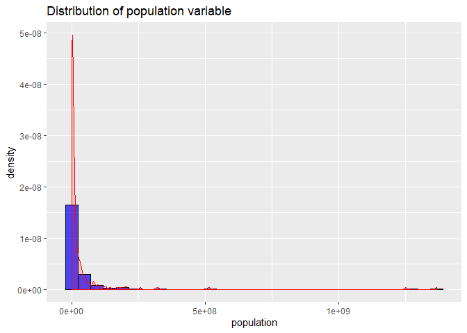
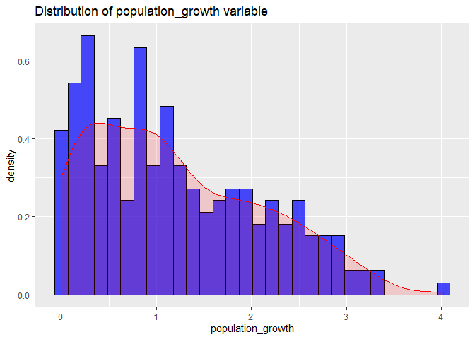
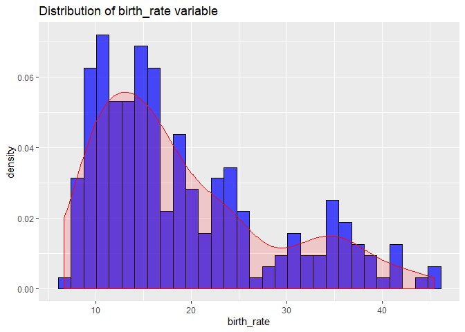
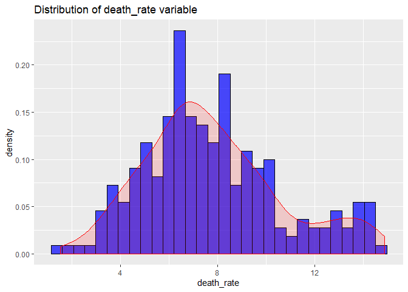
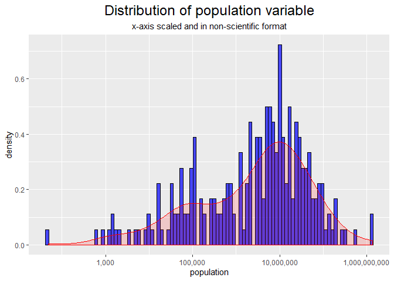
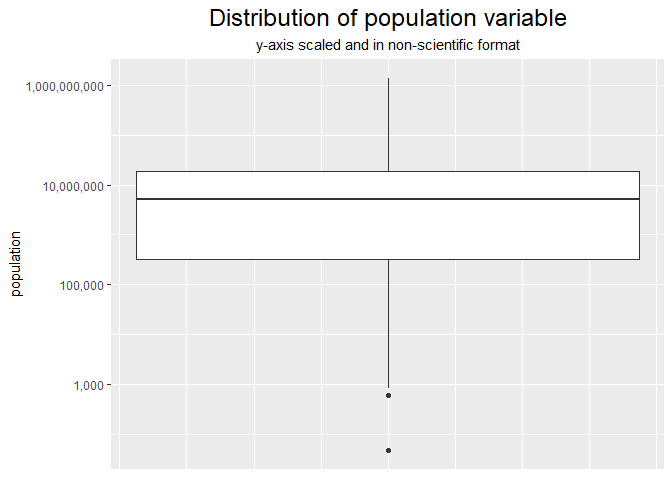
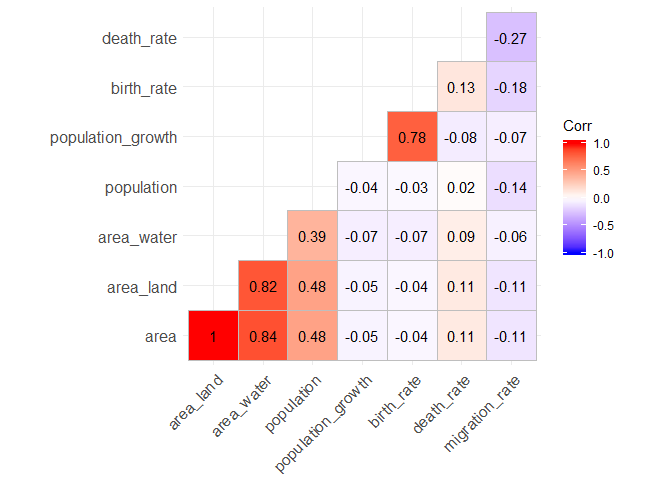

Guided Project: Analyzing CIA Factbook Data Using SQLite and R
================
Philipp Pfister

In this self solved project, which makes part of Dataquest.io Data Analyst R Track, I will analyze data from from the CIA World Factbook, a compendium of statistics about all of the countries on Earth. The Factbook contains demographic information like:

-   population - The population as of 2015.
-   population\_growth - The annual population growth rate, as a percentage.
-   area - The total land and water area.

The purpose of this project, is to get more familiar with the R packages **RSQLite** and **DBI**, by incorporating SQL into R to clean the data, understand it's summary statistics and check possible correlations between the variables which may can bring some interesting information. Further, I'll create visualizations of the data using **ggplot2** and other Tidyverse packages. The included database file can be found **[here](https://github.com/factbook/factbook.sql/releases)**.

Introduction
============

In the introduction I will:

1.  Install and load necessary packages
2.  Connecting to Database and verifying included tables
3.  Verify for NA values and fix them

#### 1. Installing a loading packages

``` r
#install.packages("RSQLite")
#install.packages("DBI")
#install.packages("ggcorrplot")
library(ggcorrplot)
library(RSQLite)
library(DBI)
library(tidyverse)
```

#### 2. Connecting to database and verifying included tables

``` r
conn <- dbConnect(SQLite(), "./factbook.db")

dbListTables(conn) #listing all tables which are in the factbook database
```

    ## [1] "facts"           "sqlite_sequence"

``` r
facts_df <- dbGetQuery(conn, 'SELECT * FROM facts') #taking a look at facts table, passing table to an object for possible later uses

str(facts_df)
```

    ## 'data.frame':    240 obs. of  13 variables:
    ##  $ id               : int  1 2 3 4 5 6 7 8 9 10 ...
    ##  $ code             : chr  "af" "al" "ag" "an" ...
    ##  $ name             : chr  "Afghanistan" "Albania" "Algeria" "Andorra" ...
    ##  $ area             : int  652230 28748 2381741 468 1246700 442 2780400 29743 7741220 83871 ...
    ##  $ area_land        : int  652230 27398 2381741 468 1246700 442 2736690 28203 7682300 82445 ...
    ##  $ area_water       : int  0 1350 0 0 0 0 43710 1540 58920 1426 ...
    ##  $ population       : int  32564342 3029278 39542166 85580 19625353 92436 43431886 3056382 22751014 8665550 ...
    ##  $ population_growth: num  2.32 0.3 1.84 0.12 2.78 1.24 0.93 0.15 1.07 0.55 ...
    ##  $ birth_rate       : num  38.57 12.92 23.67 8.13 38.78 ...
    ##  $ death_rate       : num  13.89 6.58 4.31 6.96 11.49 ...
    ##  $ migration_rate   : num  1.51 3.3 0.92 0 0.46 2.21 0 5.8 5.65 5.56 ...
    ##  $ created_at       : chr  "2015-11-01 13:19:49.461734" "2015-11-01 13:19:54.431082" "2015-11-01 13:19:59.961286" "2015-11-01 13:20:03.659945" ...
    ##  $ updated_at       : chr  "2015-11-01 13:19:49.461734" "2015-11-01 13:19:54.431082" "2015-11-01 13:19:59.961286" "2015-11-01 13:20:03.659945" ...

In the database *factbook.db*, we only have one table available, the **facts** table, which contains 13 variables and a total of 261 observations. 4 of them are character and numeric values and 5 are integers.

#### 3. Verify NA values and fixing them

I'll start by using some of R's basic functions.

``` r
summary(facts_df)
```

    ##        id             code               name                area         
    ##  Min.   :  1.00   Length:240         Length:240         Min.   :       0  
    ##  1st Qu.: 60.75   Class :character   Class :character   1st Qu.:    2186  
    ##  Median :120.50   Mode  :character   Mode  :character   Median :   73580  
    ##  Mean   :121.88                                         Mean   :  587459  
    ##  3rd Qu.:180.25                                         3rd Qu.:  414643  
    ##  Max.   :255.00                                         Max.   :17098242  
    ##    area_land          area_water       population        population_growth
    ##  Min.   :       0   Min.   :     0   Min.   :0.000e+00   Min.   :0.000    
    ##  1st Qu.:    2184   1st Qu.:     0   1st Qu.:3.161e+05   1st Qu.:0.430    
    ##  Median :   72980   Median :   470   Median :5.220e+06   Median :1.020    
    ##  Mean   :  568379   Mean   : 19080   Mean   :3.238e+07   Mean   :1.195    
    ##  3rd Qu.:  400560   3rd Qu.:  6472   3rd Qu.:1.835e+07   3rd Qu.:1.847    
    ##  Max.   :16377742   Max.   :891163   Max.   :1.367e+09   Max.   :4.020    
    ##    birth_rate      death_rate     migration_rate     created_at       
    ##  Min.   : 6.65   Min.   : 1.530   Min.   : 0.0000   Length:240        
    ##  1st Qu.:11.97   1st Qu.: 5.978   1st Qu.: 0.4375   Class :character  
    ##  Median :15.99   Median : 7.290   Median : 2.1400   Mode  :character  
    ##  Mean   :19.11   Mean   : 7.756   Mean   : 3.6326                     
    ##  3rd Qu.:23.93   3rd Qu.: 9.363   3rd Qu.: 6.1047                     
    ##  Max.   :45.45   Max.   :14.890   Max.   :22.3900                     
    ##   updated_at       
    ##  Length:240        
    ##  Class :character  
    ##  Mode  :character  
    ##                    
    ##                    
    ## 

``` r
#counting all NA values existing in the dataframe
sum(is.na(facts_df))  
```

    ## [1] 0

It is visible that throughout the whole dataset we have 193 NA values, all represented in the numeric and integer variables. I'll start to verify the area, area\_land and area\_water variables, since they are the result of addition *(area = area\_land + area\_water)*, I may can input NA values in the area variable, by adding available values of the area\_land and area\_water variable. This may also can be done vice versa.

#### Fixing area, area\_land and area\_water NA observations

``` r
# Query area, area_land and area_water columns which have NA values, to check if NAs can be inputed with new values

dbGetQuery(conn, 'SELECT id, name, area, area_land, area_water, population, population_growth, birth_rate, death_rate, migration_rate
            FROM facts
            WHERE area IS NULL OR area_land IS NULL OR area_water IS NULL
           ')
```

    ##  [1] id                name              area             
    ##  [4] area_land         area_water        population       
    ##  [7] population_growth birth_rate        death_rate       
    ## [10] migration_rate   
    ## <0 rows> (or 0-length row.names)

**Examing the result we have:**

-   21 total observations where there are at least one missing value in one of the three variables
-   9 observations where all three area variables have missing values. As 8 of them even show NAs in the other variables, these 8 lines will be dropped out of the table
-   5 observations where we have at least two values available and one is missing, here we can by addition or substraction calculate the third value
-   5 observations where we only have the area variable, but land and water are missing, in these cases I will input for the land variable, the same value from the area. The NA water values will be substituted by 0

The alterations will be done directly in the facts table using SQLite syntax.

##### 1. Case: Observations that have NA values in all three area variables. Dropping these 9 cases which present NAs in the area variables, as well as in all other numeric ones which can be seen by the previous output:

``` r
dbExecute(conn, '
            DELETE FROM facts
            WHERE area IS NULL AND area_land IS NULL AND area_water IS NULL
           ')
```

    ## [1] 0

``` r
# Check changes:
dbGetQuery(conn, 'SELECT id, name, area, area_land, area_water, population, population_growth, birth_rate, death_rate, migration_rate
            FROM facts
            WHERE area IS NULL OR area_land IS NULL OR area_water IS NULL
           ')
```

    ##  [1] id                name              area             
    ##  [4] area_land         area_water        population       
    ##  [7] population_growth birth_rate        death_rate       
    ## [10] migration_rate   
    ## <0 rows> (or 0-length row.names)

We can see that the nine cases were correctly deleted.

##### 2. Case: From three area variables, two are available and one is NA. Calculating the NA value, by adding or subtracting the two available area variables:

``` r
dbExecute(conn, 'UPDATE facts
          SET area = CASE
                        WHEN area IS NULL AND area_land IS NOT NULL AND area_water IS NOT NULL 
                            THEN area_land + area_water
                        ELSE area
                        END,
            area_land = CASE
                              WHEN area_land IS NULL AND area IS NOT NULL AND area_water IS NOT NULL
                                  THEN area - area_water
                              ELSE area_land
                              END,
            area_water = CASE
                              WHEN area_water IS NULL AND area IS NOT NULL AND area_land IS NOT NULL
                                  THEN area - area_land
                              ELSE area_water
                              END
          ')
```

    ## [1] 240

``` r
dbGetQuery(conn, 'SELECT id, name, area, area_land, area_water, population, population_growth, birth_rate, death_rate, migration_rate
            FROM facts
            WHERE area IS NULL OR area_land IS NULL OR area_water IS NULL
           ')
```

    ##  [1] id                name              area             
    ##  [4] area_land         area_water        population       
    ##  [7] population_growth birth_rate        death_rate       
    ## [10] migration_rate   
    ## <0 rows> (or 0-length row.names)

Checking again, we can see that the cases which had in the area variables one NA value and two non NA values, are now not listed anymore. Next we will take care of our third and last case regarding the area variables, which are cases where we only have the area variable, but land and water ones are missing, in these cases I will input for the land variable, the same value from the area and for the water variable I will input 0.

##### 3. Case: area variable available, but land and water are NA values. Area\_land will receive the same value as area and area\_water the value 0 instead of NA.

``` r
dbExecute(conn, '
            UPDATE facts
            SET area_land = CASE
                                WHEN area_land IS NULL AND area_water IS NULL AND area IS NOT NULL THEN
                                    area
                                ELSE area_land
                                END,
                area_water = CASE
                                WHEN area_water IS NULL THEN
                                    0
                                ELSE area_water
                                END
           ')
```

    ## [1] 240

``` r
facts_df2 <- dbGetQuery(conn, 'SELECT * FROM facts') # new facts table with deleted NA values for area variables

summary(facts_df2)
```

    ##        id             code               name                area         
    ##  Min.   :  1.00   Length:240         Length:240         Min.   :       0  
    ##  1st Qu.: 60.75   Class :character   Class :character   1st Qu.:    2186  
    ##  Median :120.50   Mode  :character   Mode  :character   Median :   73580  
    ##  Mean   :121.88                                         Mean   :  587459  
    ##  3rd Qu.:180.25                                         3rd Qu.:  414643  
    ##  Max.   :255.00                                         Max.   :17098242  
    ##    area_land          area_water       population        population_growth
    ##  Min.   :       0   Min.   :     0   Min.   :0.000e+00   Min.   :0.000    
    ##  1st Qu.:    2184   1st Qu.:     0   1st Qu.:3.161e+05   1st Qu.:0.430    
    ##  Median :   72980   Median :   470   Median :5.220e+06   Median :1.020    
    ##  Mean   :  568379   Mean   : 19080   Mean   :3.238e+07   Mean   :1.195    
    ##  3rd Qu.:  400560   3rd Qu.:  6472   3rd Qu.:1.835e+07   3rd Qu.:1.847    
    ##  Max.   :16377742   Max.   :891163   Max.   :1.367e+09   Max.   :4.020    
    ##    birth_rate      death_rate     migration_rate     created_at       
    ##  Min.   : 6.65   Min.   : 1.530   Min.   : 0.0000   Length:240        
    ##  1st Qu.:11.97   1st Qu.: 5.978   1st Qu.: 0.4375   Class :character  
    ##  Median :15.99   Median : 7.290   Median : 2.1400   Mode  :character  
    ##  Mean   :19.11   Mean   : 7.756   Mean   : 3.6326                     
    ##  3rd Qu.:23.93   3rd Qu.: 9.363   3rd Qu.: 6.1047                     
    ##  Max.   :45.45   Max.   :14.890   Max.   :22.3900                     
    ##   updated_at       
    ##  Length:240        
    ##  Class :character  
    ##  Mode  :character  
    ##                    
    ##                    
    ## 

Looking at the summary statement above, it is visible that the area, area\_land and area\_water variables have now 1 or no NA observations. Next, I'll verify and try to fix the NA values located in the population, population\_growth, birth\_rate, death\_rate and migration\_rate variables.

I'll start by displaying all observations which have at least one NA value in these variables.

``` r
dbGetQuery(conn, '
            SELECT *
            FROM facts
            WHERE population IS NULL OR 
                  population_growth IS NULL OR 
                  birth_rate IS NULL OR
                  death_rate IS NULL OR
                  migration_rate IS NULL
           ')
```

    ##  [1] id                code              name             
    ##  [4] area              area_land         area_water       
    ##  [7] population        population_growth birth_rate       
    ## [10] death_rate        migration_rate    created_at       
    ## [13] updated_at       
    ## <0 rows> (or 0-length row.names)

The query returned 29 observations where at least one of their variables have an NA value. Possible options of what to do with these NA values are to use each variables respective:

-   average value or
-   look up in the internet values for each observation

Starting with the population variable, we have 12 observations with NA values. For each one I will look up their population size using following sources:

-   [CIA World Factbook](https://www.cia.gov/library/publications/resources/the-world-factbook/)
-   [Worldbank](https://data.worldbank.org/country)

#### Fixing population NA observations

From the 12 observations, I was able to find the population of only one, [Paracel Islands](https://www.cia.gov/library/publications/the-world-factbook/geos/pf.html) (1,440 (2014 est.)). All others are territories without inhabitants. Further, all these 12 observations (including Paracel Islands) also have NA values in the other integer variables. So, after this short research I'll update the values of the population variable, and even if Paracel Island has a value for population, this one as well as the eleven other ones will be deleted.

##### Case: Observations with NA values in the population variable as well NA values in the other integer variables. All will be deleted:

``` r
#Updating Paracel Island value
dbExecute(conn, '
          DELETE 
          FROM facts
          WHERE id IN (198, 201, 202, 208, 222, 223, 228, 240, 244, 248, 252, 253)
          ')
```

    ## [1] 0

``` r
# Checking:
dbGetQuery(conn, '
            SELECT COUNT(id) FROM facts
            WHERE population IS NULL
           ')
```

    ##   COUNT(id)
    ## 1         0

Querying observations which counts observations with NA values in the variable population, we receive zero observations. So all NA values in the population variable are deleted.

Next, I will take a look at the other variables like, population\_growth, birth\_rate, death\_rate and migration\_rate. Here I will try to input estimated values using the average, of similar observations, for example from observations with similar population and area size.

##### Case: Observations with NA values in the population\_growth variable:

``` r
# Visualizing observations which still got NA values
dbGetQuery(conn, '
            SELECT *
            FROM facts
            WHERE population_growth IS NULL OR birth_rate IS NULL OR death_rate IS NULL OR migration_rate IS NULL
               ')
```

    ##  [1] id                code              name             
    ##  [4] area              area_land         area_water       
    ##  [7] population        population_growth birth_rate       
    ## [10] death_rate        migration_rate    created_at       
    ## [13] updated_at       
    ## <0 rows> (or 0-length row.names)

``` r
# Display total average population_growth and the population_growth average from countries which have a population size equal as the MAX and MIN from the observations with missing population_growth value
dbGetQuery(conn, '
            SELECT AVG(population_growth) AS total_pop_growth_avg, (SELECT AVG(population_growth)
                                                          FROM facts
                                                          WHERE population BETWEEN 0 AND 1870981 AND 
                                                                population_growth IS NOT NULL AND 
                                                                area BETWEEN 0 AND 10887
                                                        ) AS case_pop_growth_avg
            FROM facts
           ')
```

    ##   total_pop_growth_avg case_pop_growth_avg
    ## 1             1.194742            0.877619

Above we can see that the average population growth, including all data of the datset is 1.201489. Also, the average population growth of countries which have an area and population size similar to the countries with NA values in population\_growth, is 0.877619. I will use this number to input into the observations with missing population\_growth variable.

``` r
dbExecute(conn, '
          UPDATE facts
          SET population_growth = CASE
                                      WHEN population_growth IS NULL 
                                      THEN
                                        (SELECT AVG(population_growth)
                                                          FROM facts
                                                          WHERE population BETWEEN 0 AND 1870981 AND 
                                                                population_growth IS NOT NULL AND 
                                                                area BETWEEN 0 AND 10887)
                                      ELSE population_growth
                                      END
                    ')
```

    ## [1] 240

``` r
# Count how many observations do have NA values in population_growth
dbGetQuery(conn, '
            SELECT COUNT(id)
            FROM facts
            WHERE population_growth IS NULL
           ')
```

    ##   COUNT(id)
    ## 1         0

By querying all observations with NA values in population\_growth, we now see that there are no NA values anymore. Next we will do the same approach for the last three variables, birth\_rate, death\_rate and migration\_rate.

##### Case: Observations with NA values in the birth, death and migration\_rate variable:

``` r
dbExecute(conn, '
          UPDATE facts
            SET birth_rate = CASE
                                      WHEN birth_rate IS NULL 
                                      THEN
                                        (SELECT AVG(birth_rate)
                                                          FROM facts
                                                          WHERE population BETWEEN 0 AND 1870981 AND 
                                                                birth_rate IS NOT NULL AND 
                                                                area BETWEEN 0 AND 10887)
                                      ELSE birth_rate
                                      END,
            death_rate = CASE
                                      WHEN death_rate IS NULL 
                                      THEN
                                        (SELECT AVG(death_rate)
                                                          FROM facts
                                                          WHERE population BETWEEN 0 AND 1870981 AND 
                                                                death_rate IS NOT NULL AND 
                                                                area BETWEEN 0 AND 10887)
                                      ELSE death_rate
                                      END,
           migration_rate = CASE
                                      WHEN migration_rate IS NULL 
                                      THEN
                                        (SELECT AVG(migration_rate)
                                                          FROM facts
                                                          WHERE population BETWEEN 0 AND 1870981 AND 
                                                                migration_rate IS NOT NULL AND 
                                                                area BETWEEN 0 AND 10887)
                                      ELSE migration_rate
                                      END
                    ')
```

    ## [1] 240

``` r
# save cleaned table in a R dataframe
facts_cleaned <- dbGetQuery(conn, 'SELECT * FROM facts')

# count number of NA observations in cleaned dataframe
sum(is.na(facts_cleaned))
```

    ## [1] 0

``` r
summary(facts_cleaned)
```

    ##        id             code               name                area         
    ##  Min.   :  1.00   Length:240         Length:240         Min.   :       0  
    ##  1st Qu.: 60.75   Class :character   Class :character   1st Qu.:    2186  
    ##  Median :120.50   Mode  :character   Mode  :character   Median :   73580  
    ##  Mean   :121.88                                         Mean   :  587459  
    ##  3rd Qu.:180.25                                         3rd Qu.:  414643  
    ##  Max.   :255.00                                         Max.   :17098242  
    ##    area_land          area_water       population        population_growth
    ##  Min.   :       0   Min.   :     0   Min.   :0.000e+00   Min.   :0.000    
    ##  1st Qu.:    2184   1st Qu.:     0   1st Qu.:3.161e+05   1st Qu.:0.430    
    ##  Median :   72980   Median :   470   Median :5.220e+06   Median :1.020    
    ##  Mean   :  568379   Mean   : 19080   Mean   :3.238e+07   Mean   :1.195    
    ##  3rd Qu.:  400560   3rd Qu.:  6472   3rd Qu.:1.835e+07   3rd Qu.:1.847    
    ##  Max.   :16377742   Max.   :891163   Max.   :1.367e+09   Max.   :4.020    
    ##    birth_rate      death_rate     migration_rate     created_at       
    ##  Min.   : 6.65   Min.   : 1.530   Min.   : 0.0000   Length:240        
    ##  1st Qu.:11.97   1st Qu.: 5.978   1st Qu.: 0.4375   Class :character  
    ##  Median :15.99   Median : 7.290   Median : 2.1400   Mode  :character  
    ##  Mean   :19.11   Mean   : 7.756   Mean   : 3.6326                     
    ##  3rd Qu.:23.93   3rd Qu.: 9.363   3rd Qu.: 6.1047                     
    ##  Max.   :45.45   Max.   :14.890   Max.   :22.3900                     
    ##   updated_at       
    ##  Length:240        
    ##  Class :character  
    ##  Mode  :character  
    ##                    
    ##                    
    ## 

``` r
# check observation which still has one NA value
facts_cleaned %>%
    filter(is.na(area))
```

    ##  [1] id                code              name             
    ##  [4] area              area_land         area_water       
    ##  [7] population        population_growth birth_rate       
    ## [10] death_rate        migration_rate    created_at       
    ## [13] updated_at       
    ## <0 rows> (or 0-length row.names)

As seen above, from 193 NA values at the beginning, we were able to reduce all missing values to only one. Further, instead of deleting all NA values right away, which wouldn't be a good decision, since the whole dataset just have a small number of observations (261), it was considered more valuable to use the average values of each variable.

Next, we will get to the main part where we will:

-   look at summary statistics
-   check correlations between the variables

Main Part
=========

Here I'll calculate some summary statistics and check for any outlier countries. I'll do this by writing a single query that returns the:

-   minimum population
-   maximum population
-   minimum population growth
-   maximum population growth

``` r
dbGetQuery(conn, 'SELECT
          MIN(population), MAX(population), MIN(population_growth), MAX(population_growth)
          FROM facts
          ')
```

    ##   MIN(population) MAX(population) MIN(population_growth)
    ## 1               0      1367485388                      0
    ##   MAX(population_growth)
    ## 1                   4.02

``` r
var(facts_cleaned$population)
```

    ## [1] 1.650137e+16

Looking at the results it seems that:

-   there's a country with a population of 0
-   there's a country with a population of 1367485388 or around 1.36 billion people!

Following I'll include in the query above, the country name variable and a *WHERE* condition to select the cases we just asked for.

``` r
dbGetQuery(conn, 'SELECT
          name, population, population_growth
          FROM facts
          WHERE population = (SELECT MIN(population) FROM facts) OR
                population = (SELECT MAX(population) FROM facts) OR
                population_growth = (SELECT MIN(population_growth) FROM facts) OR
                population_growth = (SELECT MAX(population_growth) FROM facts)
          ')
```

    ##                      name population population_growth
    ## 1                   China 1367485388          0.450000
    ## 2             South Sudan   12042910          4.020000
    ## 3 Holy See (Vatican City)        842          0.000000
    ## 4 Cocos (Keeling) Islands        596          0.000000
    ## 5               Greenland      57733          0.000000
    ## 6        Pitcairn Islands         48          0.000000
    ## 7              Antarctica          0          0.877619

Above we can identify the two cases with extreme low and high population value, these are, the 0 population case, which is Antartica as well as an entry of Chinas total population. Since Antartica is not a normal country with regular inhabitants and the only not permanent inhabitants are scientist , I'll exclude it in a revised query, as well as save the result in a new object.

``` r
facts_cleaned <- dbGetQuery(conn, "SELECT *
           FROM facts 
           WHERE  (population != (SELECT MIN(population) FROM facts))
           ")

df_clean2 <- dbGetQuery(conn, "SELECT 
                                   name, population, population_growth, birth_rate, death_rate 
                                   FROM facts 
                                   WHERE  (population != (SELECT MIN(population) FROM facts))
                                   ")

head(df_clean2)
```

    ##                  name population population_growth birth_rate death_rate
    ## 1         Afghanistan   32564342              2.32      38.57      13.89
    ## 2             Albania    3029278              0.30      12.92       6.58
    ## 3             Algeria   39542166              1.84      23.67       4.31
    ## 4             Andorra      85580              0.12       8.13       6.96
    ## 5              Angola   19625353              2.78      38.78      11.49
    ## 6 Antigua and Barbuda      92436              1.24      15.85       5.69

Now I'll create histograms for each of the columns. Using just the non-outlier rows, generating histograms for the following columns:

-   population
-   population\_growth
-   birth\_rate
-   death\_rate

``` r
# z = column vector
histog <- function (z) {
  ggplot(data = df_clean2) + 
    aes_string(x = z) +
    geom_histogram(aes(y =..density..), 
                 col="black",
                 fill="blue", 
                 alpha= 0.7) +
    geom_density(col=2,
                 fill = "red",
                 alpha = 0.15) + # adding density line
    ggtitle(paste("Distribution of", z, "variable")) +
    geom_vline(aes(xintercept = mean(z)),col='red')
}


# Create the vector z:
z = names(df_clean2[,2:5])    # from the dataframe df2 selecting the columns: population

# Using map function from purrr package to run the function with the vector z:
map(z, histog)
```

    ## [[1]]



    ## 
    ## [[2]]



    ## 
    ## [[3]]



    ## 
    ## [[4]]



It is visable that none of the variables have a normal, bell shaped distribution (so, not suitable for linear regression models), all of them, except the *death\_rate* variable, are right skewed. Further we have extreme outliers in the population variable, which should be caused by countries like China and India. But since the population histogram is very skewed and difficult to read, I'll redo it, scaling the x-axis properly as well as trying to use a different number of bins.



``` r
# summary statistics of population variable
format(summary(df_clean2$population), scientific = FALSE)
```

    ##         Min.      1st Qu.       Median         Mean      3rd Qu. 
    ## "        48" "    328258" "   5231422" "  32512449" "  18544404" 
    ##         Max. 
    ## "1367485388"

After adjusting the population histogram and adding a boxplot graphic, it is clear that around 50% of the countries found in the fact table have a population of more than 100,000 to a bit more than 10,000,000 inhabitants. Using R's basic summary function shows that the median value is around *5.23 million* people.

### Check possible correlations by displaying a heatmap

I'll will check if between the variables: area, area\_land, area\_water, population, population\_growth, birth\_rate, death\_rate and migration\_rate exists some kind of correlation, using defaults pearson correlation.

``` r
# creating dataframe that includes only necessary variables:
facts_cleaned2 <- facts_cleaned[, 4:11]

# create a correlation matrix:
fact_cor <- cor(facts_cleaned2)

ggcorrplot(fact_cor, type = "lower", lab = TRUE)
```



As it can be seen from the correlation graph above, we have medium to strong correlations between the area variables, which makes sense, further we have a strong correlation between the population\_growth and birth\_rate variables, which is logical, since a higher birth\_rate results normally in more people in the country and since this, a growing population. Besides of this we have a very weak negative correlation (-0.27) between death\_rate and migration\_rate. This is a correlation I expected to be positive and maybe even stronger. Since I thought that more people would leave a country and migrate to another if the death\_rate of its original country would be high.

Conclusion and Disconnecting Database
========================================

So, this projects aim was to increase familarity into the SQL package **RSQLite**, using its functions to accomplish basic summary statistics as well as to clean and fix the data set, here especially the NA values which we found at the beginning. Further, by using **ggplot2** as well as **ggcorrplot** our aim was to better understand the data, how it is distributed and how each variable is correlated to each other, to find out some interesting correlations.

Unfortunately, the available data was limited with only 261 observations, not containing year data to verify the development of some variables over time and for specific countries, as well it did not contain social or economical information, to dig in deeper.

``` r
# Clear results and disconnect from database
dbDisconnect(conn)
```
